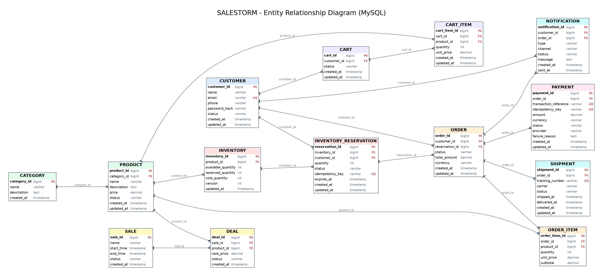

# SALESTORM Database Schema

## Database

MySQL relational database.

The relational database is the authoritative source of truth for transactional data and inventory state.

Redis is used only for caching and does not determine inventory availability.



---

## Core Tables

### CUSTOMER

Stores customer information.

Key fields:

- customer_id — Primary Key
- name
- email — Unique
- phone
- password_hash
- status
- created_at
- updated_at

---

### CATEGORY

Stores product categories.

Key fields:

- category_id — Primary Key
- name
- description
- created_at

---

### PRODUCT

Stores product information.

Key fields:

- product_id — Primary Key
- category_id — Foreign Key → CATEGORY
- name
- description
- price
- status
- created_at
- updated_at

---

### SALE

Stores flash-sale information.

Key fields:

- sale_id — Primary Key
- name
- start_time
- end_time
- status
- created_at

---

### DEAL

Maps products to flash-sale deals.

Key fields:

- deal_id — Primary Key
- sale_id — Foreign Key → SALE
- product_id — Foreign Key → PRODUCT
- sale_price
- status
- created_at

---

### INVENTORY

Stores authoritative inventory state.

Key fields:

- inventory_id — Primary Key
- product_id — Foreign Key → PRODUCT
- available_quantity
- reserved_quantity
- sold_quantity
- version
- updated_at

Example (flash sale of 100 units):

| Moment | available | reserved | sold |
|---|---|---|---|
| Sale starts | 100 | 0 | 0 |
| Customer 1 reserves one | 99 | 1 | 0 |
| After successful payment | 99 | 0 | 1 |
| If payment fails / reservation expires | 100 | 0 | 0 |

The database is the source of truth. Redis does not decide whether stock exists.

---

### INVENTORY_RESERVATION

Stores temporary inventory reservations.

Key fields:

- reservation_id — Primary Key
- inventory_id — Foreign Key → INVENTORY
- customer_id — Foreign Key → CUSTOMER
- quantity
- status
- idempotency_key — Unique
- expires_at
- created_at
- updated_at

Lifecycle:

```
RESERVED
   │
   ├── Payment success ──→ CONFIRMED
   │
   ├── Payment failure ──→ RELEASED
   │
   └── Timeout ──────────→ EXPIRED → RELEASED
```

---

### CART

Stores customer carts.

Key fields:

- cart_id — Primary Key
- customer_id — Foreign Key → CUSTOMER
- status
- created_at
- updated_at

---

### CART_ITEM

Stores products within carts.

Key fields:

- cart_item_id — Primary Key
- cart_id — Foreign Key → CART
- product_id — Foreign Key → PRODUCT
- quantity
- unit_price
- created_at
- updated_at

---

### ORDER

Stores customer orders. (In MySQL the physical table must be named `orders` because `ORDER` is a reserved word.)

Key fields:

- order_id — Primary Key
- customer_id — Foreign Key → CUSTOMER
- reservation_id — Foreign Key → INVENTORY_RESERVATION
- status
- total_amount
- currency
- created_at
- updated_at

Order lifecycle:

```
CREATED → PAYMENT_PENDING → CONFIRMED → PROCESSING → SHIPPED → OUT_FOR_DELIVERY → DELIVERED
```

---

### ORDER_ITEM

Stores products belonging to an order.

Key fields:

- order_item_id — Primary Key
- order_id — Foreign Key → ORDER
- product_id — Foreign Key → PRODUCT
- quantity
- unit_price
- subtotal

---

### PAYMENT

Stores payment transactions.

Key fields:

- payment_id — Primary Key
- order_id — Foreign Key → ORDER
- transaction_reference — Unique
- idempotency_key — Unique
- amount
- currency
- status (PENDING, SUCCESS, FAILED, TIMEOUT, REFUNDED)
- provider
- failure_reason
- created_at
- updated_at

---

### SHIPMENT

Stores shipment information.

Key fields:

- shipment_id — Primary Key
- order_id — Foreign Key → ORDER
- tracking_number — Unique
- carrier
- status
- shipped_at
- delivered_at
- created_at
- updated_at

---

### NOTIFICATION

Stores notification delivery information.

Key fields:

- notification_id — Primary Key
- customer_id — Foreign Key → CUSTOMER
- order_id — Foreign Key → ORDER
- type
- channel
- status
- message
- created_at
- sent_at

---

## Relationships

| Parent | Child | Cardinality |
|---|---|---|
| CATEGORY | PRODUCT | 1 : N |
| PRODUCT | INVENTORY | 1 : 1 (one stock row per product) |
| SALE | DEAL | 1 : N |
| PRODUCT | DEAL | 1 : N |
| INVENTORY | INVENTORY_RESERVATION | 1 : N |
| CUSTOMER | CART, INVENTORY_RESERVATION, ORDER, NOTIFICATION | 1 : N |
| CART | CART_ITEM | 1 : N |
| INVENTORY_RESERVATION | ORDER | 1 : 1 |
| ORDER | ORDER_ITEM, PAYMENT, SHIPMENT, NOTIFICATION | 1 : N |

## Transaction Boundaries

**Reserve inventory** (one transaction)

1. Look up an existing reservation by `idempotency_key`; if found, return it.
2. Conditionally update stock:
   ```sql
   UPDATE inventory
      SET available_quantity = available_quantity - :qty,
          reserved_quantity  = reserved_quantity  + :qty,
          version = version + 1
    WHERE product_id = :productId
      AND available_quantity >= :qty;
   ```
   If no row is updated → insufficient inventory → rollback.
3. Insert `INVENTORY_RESERVATION` (`RESERVED`, `expires_at`).
4. Commit.

**Payment success:** reservation `CONFIRMED`; inventory `reserved − qty`, `sold + qty`; order `CONFIRMED`.

**Payment failure / timeout / expiry:** reservation `RELEASED` (via `EXPIRED` on timeout); inventory `reserved − qty`, `available + qty`.

Each step is a short local transaction and is idempotent so it can safely be retried.
